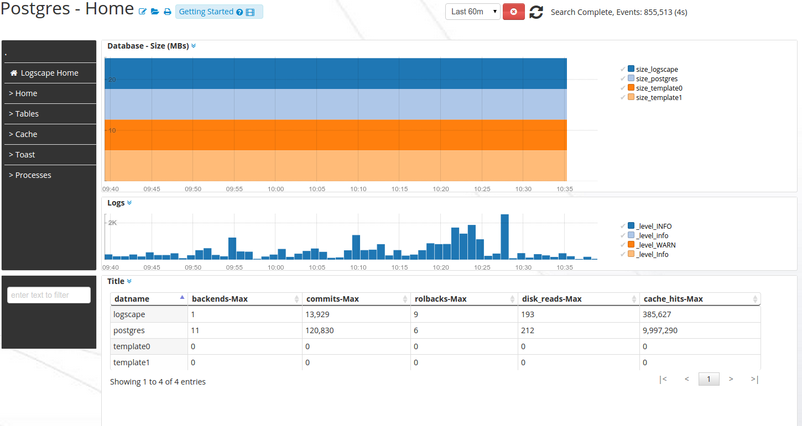
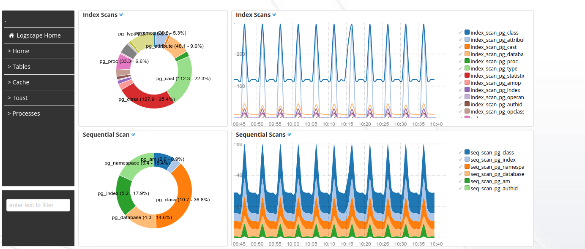
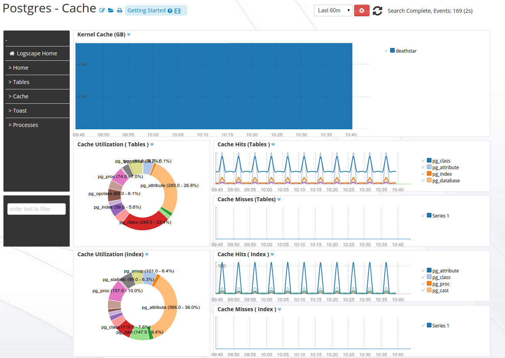

PostgresApp-1.1 
===========

The PostgresApps monitors tables, indexes and resource utilisation

## Properties 

 defaultUser,defaultPassword -  Username and password of postgres monitoring user. This user should have read only access to system tables 
 hostnames - a list of postgres hosts to monitor 
 

## Downloads 

 * [PostgresApp-1.1.zip](https://github.com/logscape/postgresapp/raw/master/dist/PostgresqlApp-1.0.zip)
 * [Example Properties File ](https://github.com/logscape/postgresapp/raw/master/dist/PostgresqlApp-1.0-override.properties)

## Overview

The Home Workspace gives you an overview of your databases and a view of  your postgres logs. The App is split into four categories

	* Tables - displays the scan for the tables. Your query profiles. 
	* Cache  - displays the buffer hit and miss counts for the tables and indexes. 
	* Toast -  displays information about the toast tables and their buffer hit performance. 
	* Processes  - displays the kernel cache, cpu and memory utilization of postgres processes 

## Home 
 

## Tables 

 

## Cache 

 
